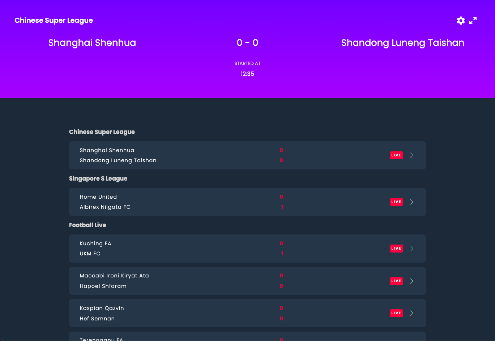
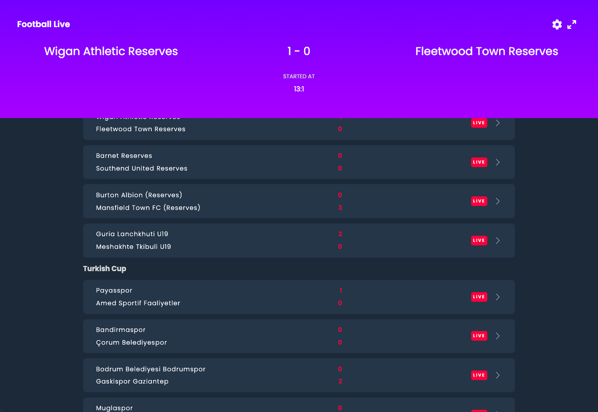
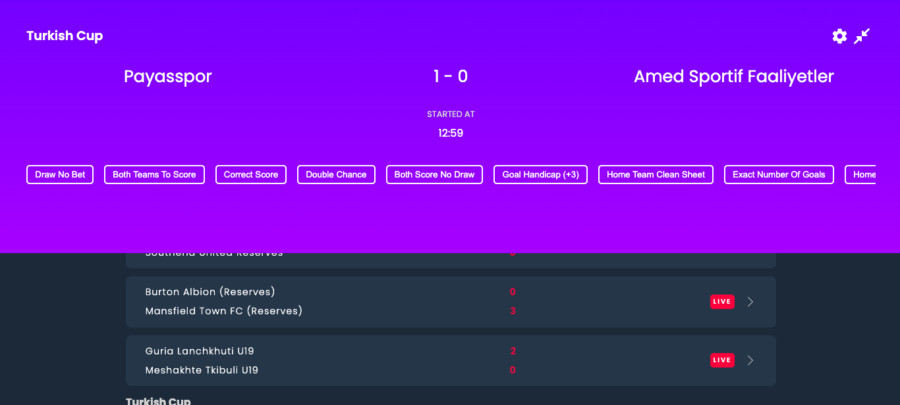
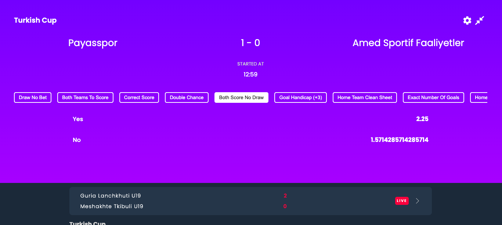
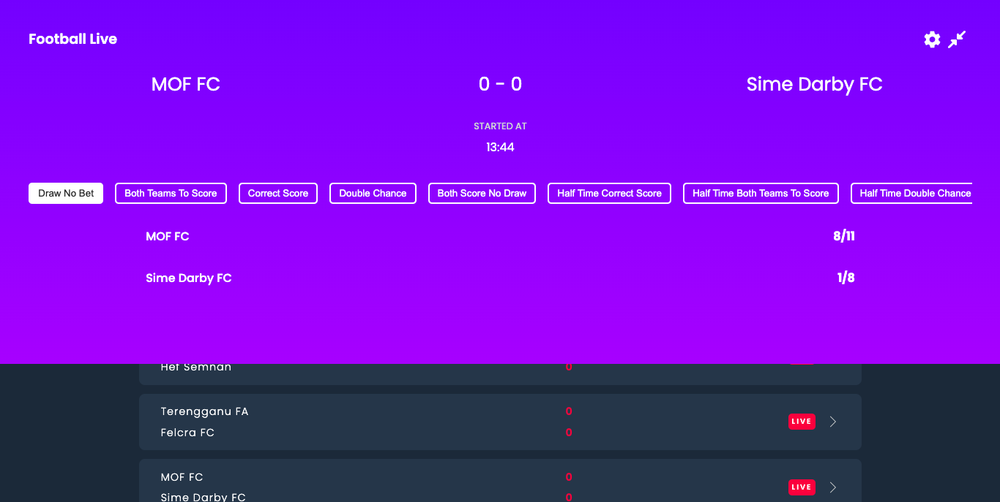
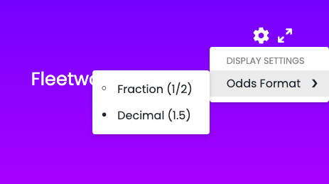

# Live Football Event App

## Table of Contents

-   [How To Run](#howtorun)
    -   [Starting the app](#startingtheapp)
    -   [Running the tests](#runningthetests)
-   [UI Explained](#uiexplained)
    -   [Events Overview](#eventsoverview)
    -   [Selected Events](#selectedevents)
    -   [Dynamic Loading](#dynamicloading)
    -   [Odds Format](#oddsdisplay)
-   [Tasks Completed](#taskscompleted)
    -   [Task One](#taskone)
    -   [Task Two](#tasktwo)
    -   [Task Three](#taskthree)
-   [Future Features](#futurefeatures)

## <a name="howtorun"></a> How To Run

### <a name="startingtheapp"></a> Starting the App

To start the app, first ensure you have the [sbgtechtest/api](https://hub.docker.com/r/sbgtechtest/api/) docker container running with the relevant ports exposed.

You can run this using the following compose method:

```yaml
version: '3'
services:
    api:
        image: sbgtechtest/api:latest
        ports:
            - '8888-8890:8888-8890'
```

Or the following docker run command:

```bash
docker run -it --rm --name sbg-tech-test-api -p 8888-8890:8888-8890 sbgtechtest/api:2.0.0
```

Once running, install the relevant packages:

```bash
npm i
```

Then run the application with:

```bash
npm start
```

You can now view your app on port `3000` -> [here](http://localhost:3000).

### <a name="runningthetests"></a> Running the Tests

To enter the interactive test suite, run the following command:

```bash
npm t
```

## <a name="uiexplained"></a> UI Explained

### <a name="eventsoverview"></a> Events Overview

The events overview screen loads as a custom table view like so:



Events are filtered by `displayable`, and sorted into groups via the `linkedEventTypeName` property.



By default, any selected events take visual priority in the top sticky panel.

### <a name="selectedevents"></a> Selected Events

As mentioned above, when an event is selected, it is presented to the top sticky panel.

When selected, it uses the already fetched event object from the `getLiveEvents` api. This way no new network calls are required until the user is sure they wish to fetch new detail.

### <a name="dynamicloading"></a> Dynamic Loading

If the user wishes to see more information regarding an event, they can click the expand icon on the top right of the panel.



When exanded, the event markets will be displayed by first fetchig the market ID's via the `getEvent` api, and then querying the first 10 of these with the `getMarket` api.

These markets are **horizontally scrollable** and can be clicked.

If clicked, the outcomes related to that market will be loaded via the `getOutcome` api.




### <a name="oddsdisplay"></a> Odds Display

The top right setting button contains the display settings, where the odds format can be changed.



## <a name="taskscompleted"></a> Tasks Completed

### <a name="taskone"></a> Task One

&check; 1. Display Live Football event in an overview

&cross; 2. Show primary markets for each event

&check; 3. Show outcomes for each market

&check; 4. Toggle odds display globally

### <a name="tasktwo"></a> Task Two

&check; 1. Browse full details of an event

&check; 2. Inform users of type, start time, and scores

&check; 3. Use the event payload to show all markets for available for the event

&check; 4. Show the outcomes for the first 10 markets only

&check; 5. Markets should be in displayOrder (ascending) and then name

&check; 6. Load outcomes for the market on demand

&check; 6. Use the `displayable` status to filter events

&check; 6. Use the `displayable` status to filter markets and outcomes

### <a name="taskthree"></a> Task Three

&cross; 1. Subscribe to events, market, and outcomes of interest

&check; 2. Group events by `linkedEventTypeName`, a missing value should cause the grouping to fallback to the `typeName` property

&cross; 3. Add support for displaying markets with different types

&cross; 4. Allow the user to click on outcomes to add them to a bet slip

&cross; 5. Manage WebSocket subscriptions to allow the bet slip to listen for updates to selected outcomes and markets as and when they change, and invalidate selections as appropriate

## <a name="futurefeatures"></a> Future Features

### Primary Markets

At first, the primary markets were being loaded into the sticky panel instead of the full market set - this was a mistake on behalf when reading the task and upon correction, I ran out of time to add the primary market to each table cell via a toggle in the settings menu.

### Contexts Optimisation

By design, contexts where choses to reduce the need for redux, and provide a simple way to pass event information between parallel components. However, contexts re-render all children upon updates to the value - meaning some performance hits.

For small apps such as this, its not much of an issue, but the impact of it can be reduced by using the `useMemo` hook on certain values.

Due to this, changing the odds format causes a re-render, and the state of the outcomes do not persist and a market has to be re-selected for the odds format change to take effect.

With more time, I would probably reload the currently selected outcomes in the `useEffect` hook to persist the UI state.

### Subscriptions

Using the subcribe options on the websocket, I would have liked to have completed this with more time on my behalf.

I would have added a button in the sticky panel to subscribe to events and use basic states to update the UI.

### Subscriptions

Again, lack of time on my behalf meant I did not attempt this part of the assesment.

### Responsiveness

For time constraints, I did not attempt to make this application mobile responsive, but would have added simple media queries to the css if this was the case.

### Logging

A package like `loglevel` would have been useful for production use and even development purposes.
